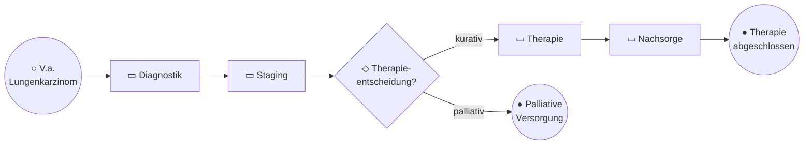
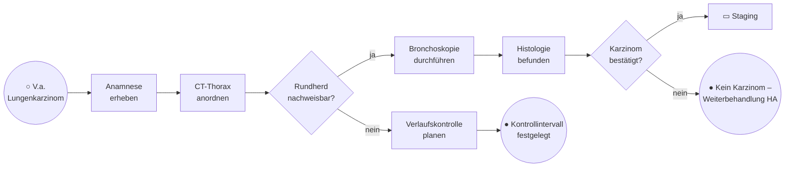
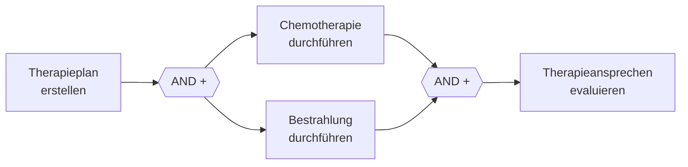
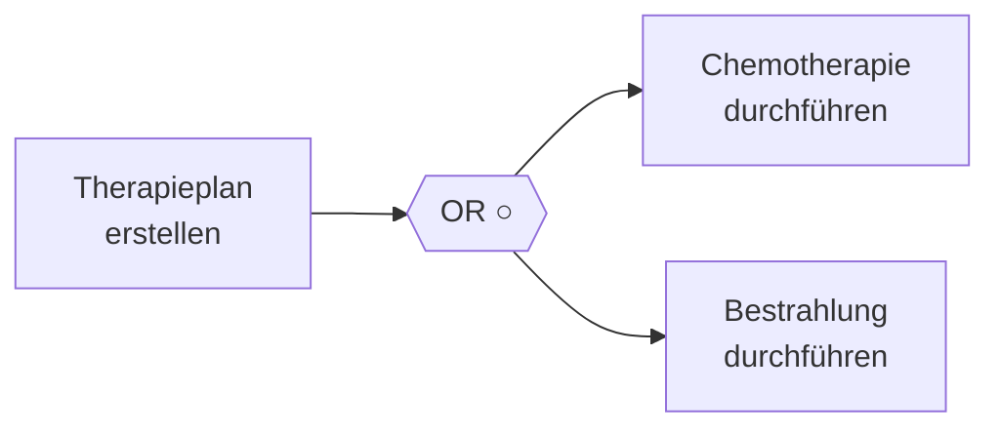
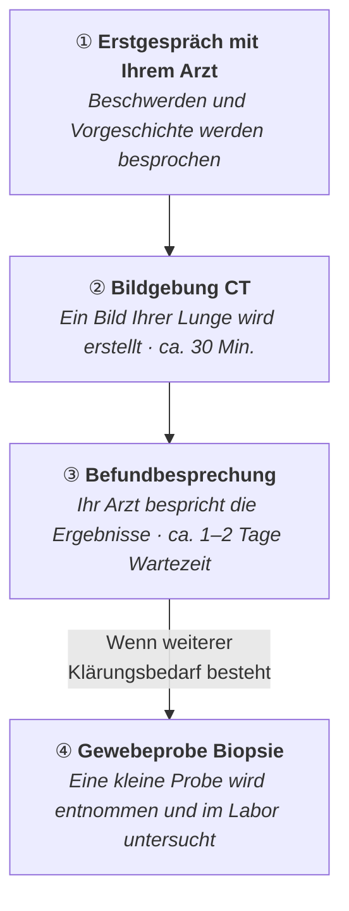
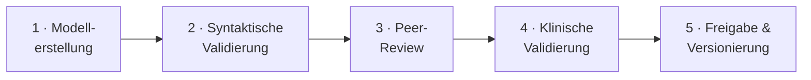

# Modellierungsrichtlinien für Patientenpfade

> **Hinweis zur Veranschaulichung:** Die Beispiele in diesem Dokument verwenden durchgängig den onkologischen Patientenpfad (Lungenkarzinom) zur Illustration. Die Richtlinien selbst sind **domänenübergreifend** auf klinische Patientenpfade übertragbar – etwa in der Kardiologie, Neurologie oder Chirurgie.

---

## Inhaltsverzeichnis

1. [Zweck und Geltungsbereich](#1-zweck-und-geltungsbereich)
2. [Theoretische Grundlagen](#2-theoretische-grundlagen)
3. [Kernrichtlinien (basierend auf 7PMG)](#3-kernrichtlinien-basierend-auf-7pmg)
4. [Layoutrichtlinien](#4-layoutrichtlinien)
5. [Klinische Domänenrichtlinien](#5-klinische-domänenrichtlinien)
6. [Datenobjekte und Systemintegration](#6-datenobjekte-und-systemintegration)
7. [Adressatengerechte Modellsichten](#7-adressatengerechte-modellsichten)
8. [Qualitätssicherung](#8-qualitätssicherung)
9. [Empfohlene Werkzeuge](#9-empfohlene-werkzeuge)
10. [Quellenverzeichnis](#10-quellenverzeichnis)

---

## 1 Zweck und Geltungsbereich

Diese Richtlinien geben Orientierung für die Modellierung von BPMN-Prozessmodellen im Kontext klinischer Patientenpfade. Sie richten sich an alle Beteiligten, die Patientenpfade modellieren, reviewen oder interpretieren – unabhängig davon, ob sie einen klinischen, informationstechnischen oder organisatorischen Hintergrund haben.

Die Richtlinien basieren auf empirisch fundierten akademischen Leitlinien und etablierten Praxis-Best-Practices, ergänzt um domänenspezifische Empfehlungen für den medizinischen Kontext.

**Anwendungsbereich:** Intersektorale Patientenpfade in der klinischen Versorgung – vom Erstkontakt über Diagnostik, Therapie und Nachsorge bis zur Rehabilitation – insbesondere bei einrichtungsübergreifender Zusammenarbeit.

---

## 2 Theoretische Grundlagen

Die Richtlinien stützen sich auf folgende Quellen:

| Quelle                                                    | Beschreibung                                                                                                   |
| --------------------------------------------------------- | -------------------------------------------------------------------------------------------------------------- |
| **7PMG** – Mendling, Reijers & van der Aalst (2010) [1]   | Sieben empirisch validierte Leitlinien für Verständlichkeit und Fehlerreduktion von Prozessmodellen            |
| **GoM** – Becker, Rosemann & von Uthmann (2000) [2]       | Sechs Prinzipien: Korrektheit, Klarheit, Relevanz, Vergleichbarkeit, Wirtschaftlichkeit, systematischer Aufbau |
| **BPM+ Health Field Guide v2.0** – OMG (2020) [3]         | Domänenspezifische Best Practices für klinische Pfade mit BPMN, CMMN und DMN                                   |
| **BPMN Method & Style** – Bruce Silver (2011) [4]         | Drei Modellierungsniveaus (Descriptive, Analytical, Executable) für unterschiedliche Stakeholder               |
| **50 Guidelines Framework** – Corradini et al. (2018) [5] | Umfassendstes Regelwerk für BPMN-Verständlichkeit, konsolidiert aus 89 Literaturquellen                        |

---

## 3 Kernrichtlinien (basierend auf 7PMG)

Die sieben Leitlinien nach Mendling et al. (2010) [1] bilden das Rückgrat. Jede Richtlinie ist empirisch fundiert und wird nachfolgend auf den Kontext klinischer Patientenpfade übertragen.

### Übersicht

| Richtlinie | Empfehlung                     | Anwendung auf Patientenpfade                                                                                            | Quelle      |
| ---------- | ------------------------------ | ----------------------------------------------------------------------------------------------------------------------- | ----------- |
| **R1**     | So wenige Elemente wie möglich | Max. 30–50 Elemente pro Diagramm. Supportprozesse (z. B. Terminkoordination) in separate Modelle auslagern.             | 7PMG G1 [1] |
| **R2**     | Routing-Pfade minimieren       | Pro Gateway max. 3–4 Ausgänge. Komplexe Entscheidungen in Business Rule Tasks oder DMN auslagern.                       | 7PMG G2 [1] |
| **R3**     | Ein Start, benannte Enden      | Klinische End-Zustände explizit benennen, z. B. „Kurative Therapie abgeschlossen", „Palliative Versorgung eingeleitet". | 7PMG G3 [1] |
| **R4**     | Strukturiert modellieren       | Jedes Split-Gateway sollte ein korrespondierendes Join-Gateway besitzen. Überkreuzende Sequenzflüsse vermeiden.         | 7PMG G4 [1] |
| **R5**     | OR-Gateways vermeiden          | Statt inklusivem OR explizite XOR- oder AND-Gateways verwenden.                                                         | 7PMG G5 [1] |
| **R6**     | Verb-Objekt-Labeling           | Aktivitäten im Schema „Verb + Objekt" benennen. Gateways als Frage formulieren.                                         | 7PMG G6 [1] |
| **R7**     | Zerlegung ab 50 Elementen      | Phasen als Subprozesse gliedern.                                                                                        | 7PMG G7 [1] |

> **Priorisierung** (Mendling et al. 2010 [1], Table 2): R4 (Strukturierung) > R7 (Dekomposition) > R1 (Minimalismus) > R6 (Labeling) > R2 > R3 > R5

---

### 3.1 R1 – Modellgröße minimieren

Größere Modelle führen nachweislich zu mehr Fehlern und geringerer Verständlichkeit. Mendling et al. (2010) [1] zeigten eine positive Korrelation zwischen Modellgröße und Fehlerwahrscheinlichkeit; ab 50 Elementen steigt die Fehlerrate erheblich an (vgl. [1], Abschnitt 3.3, G7).

> ✅ **Gutes Beispiel – Patientenpfad als Übersicht**
> _(Illustration am Beispiel Lungenkarzinom)_

→ 8 sichtbare Elemente, Details in den kollabierten Subprozessen

> ❌ **Schlechtes Beispiel**
>
> Alle Einzelschritte von Anamnese bis Nachsorge in einem einzigen Diagramm mit 120+ Elementen, verschachtelten Gateways und kreuzenden Sequenzflüssen.

---

### 3.2 R6 – Verb-Objekt-Labeling im Detail

Konsistente Benennung ist der wichtigste Einzelfaktor für die Verständlichkeit. Mendling, Reijers & Recker (2010) [6] zeigten in einem Experiment mit 29 Teilnehmenden, dass der Verb-Objekt-Stil (z. B. „Befund erstellen") signifikant weniger mehrdeutig und nützlicher eingeschätzt wird als der Action-Noun-Stil (z. B. „Befunderstellung") oder unstrukturierte Labels.

| Elementtyp   | Schema                       | ✅ Gutes Beispiel               | ❌ Schlechtes Beispiel |
| ------------ | ---------------------------- | ------------------------------- | ---------------------- |
| Task         | Verb + Objekt                | CT-Thorax anordnen              | CT                     |
| Subprozess   | Substantiv (Phase)           | Primärtherapie                  | Therapie machen        |
| XOR-Gateway  | Frage mit „?"                | Fernmetastasen vorhanden?       | Staging                |
| AND-Gateway  | Kein Label oder „(parallel)" | (parallel)                      | Und dann               |
| Start-Event  | Substantiv / Zustand         | V.a. Lungenkarzinom             | Start                  |
| End-Event    | Ergebnis / Zustand           | Kurative Therapie abgeschlossen | Ende                   |
| Sequenzfluss | Bedingung an XOR-Ausgängen   | ja / nein / Default             | _(ohne Label)_         |

> _Quelle: Mendling, Reijers & Recker (2010) [6]; Mendling et al. (2010), 7PMG G6 [1]._

---

### 3.3 Happy Path hervorheben

Der Regelpfad (Patient durchläuft den Standardpfad erfolgreich) sollte visuell als zentrale horizontale Achse erkennbar sein. Alternativpfade werden **unterhalb** modelliert [4].

> ✅ **Beispiel: Diagnostikphase** _(Illustration am Beispiel Lungenkarzinom)_

> _Quelle: Silver (2011) [4]; Trisotech (2022) [8]._

---

## 4 Layoutrichtlinien

### 4.1 Allgemeines Layout

| Richtlinie              | Beschreibung                                                       | Quelle |
| ----------------------- | ------------------------------------------------------------------ | ------ |
| Links-nach-rechts-Fluss | Sequenzflüsse verlaufen horizontal. Happy Path = zentrale Achse.   | [8]    |
| Message Flows vertikal  | Nachrichtenflüsse zwischen Pools verlaufen vertikal (gestrichelt). | [9]    |
| Keine kreuzenden Linien | Falls unvermeidbar → dekomponieren (R7).                           | [2]    |
| Ausnahmen nach unten    | Exception Flows und Alternativpfade unterhalb des Happy Path.      | [4]    |
| Einheitliche Größen     | Tasks ca. 100×80px, Events 36px ⌀, Gateways 50×50px (Richtwerte).  | [5]    |

### 4.2 Pool- und Lane-Struktur bei einrichtungsübergreifenden Pfaden

Intersektorale Patientenpfade umfassen typischerweise mehrere Einrichtungen und Systeme. Die Pool-/Lane-Zuordnung ist daher zentral:

| Element            | Empfohlene Verwendung                                | Illustratives Beispiel                             |
| ------------------ | ---------------------------------------------------- | -------------------------------------------------- |
| **Pool**           | Je eine beteiligte Organisation oder ein System      | Pool „Klinikum A", Pool „Datenintegrationszentrum" |
| **Lane**           | Rollen oder Abteilungen innerhalb einer Organisation | Lane „Pneumologie", „Pathologie", „Tumorboard"     |
| **Message Flow**   | Intersektoraler Datenaustausch (z. B. FHIR, DSF)     | Gestrichelt: „Befund übermitteln (FHIR R4)"        |
| **Black-Box Pool** | Externe Systeme ohne modellierten internen Prozess   | Pool „Forschungsdatenportal" (kollabiert)          |

> _Quelle: BPMN 2.0 Specification (OMG, ISO/IEC 19510) [9]; Trisotech (2022) [8]._

---

## 5 Klinische Domänenrichtlinien

### 5.1 Klinische Entscheidungspunkte

Medizinische Entscheidungen unterscheiden sich von typischen Business-Entscheidungen durch ihre Evidenzbasis und die häufige Beteiligung interdisziplinärer Gremien (z. B. Tumorboard, Herzteam). Martínez-Salvador et al. (2022) [10] identifizierten als Schlüsselanforderungen u. a. die Abbildbarkeit von Evidenzklassen und Verweisen auf Leitlinienquellen.

| Situation                       | Empfohlene Modellierung                                      | Illustratives Beispiel                            |
| ------------------------------- | ------------------------------------------------------------ | ------------------------------------------------- |
| Leitlinienbasierte Entscheidung | **Business Rule Task** mit Annotation zur Leitlinienreferenz | „Therapieentscheidung gemäß S3-LL Lungenkarzinom" |
| Komplexe Entscheidungslogik     | In **DMN Decision Table** auslagern                          | TNM-basierte Therapieauswahl                      |
| Gremienentscheidung             | **User Task** in eigener Lane mit Timer-Event                | ⏰ Max. 7 Tage bis Besprechung                    |

> _Quelle: BPM+ Health Field Guide v2.0 [3]; Martínez-Salvador et al. (2022) [10]; Mendling et al. (2010) [1], G2/G5._

### 5.2 Zeitliche Aspekte

Zeit ist im klinischen Kontext oft therapierelevant (z. B. Time-to-Treatment, Nachsorgeintervalle). Martínez-Salvador et al. (2022) [10] nennen zeitliche Abhängigkeiten und explizite Zeitereignisse als eine der vier Kernanforderungen an jede CP-Modellierungssprache. An zeitkritischen Stellen sollten folgende BPMN-Elemente eingesetzt werden:

| Situation                     | BPMN-Element                         | Illustratives Beispiel          |
| ----------------------------- | ------------------------------------ | ------------------------------- |
| Max. Wartezeit auf Befund     | Timer Intermediate Event (attached)  | ⏰ 48h an „Histologie befunden" |
| Zeitfenster Therapiebeginn    | Timer Intermediate Event (catching)  | ⏰ „Innerhalb 14 Tage"          |
| Wiederkehrende Nachsorge      | Timer Start Event (non-interrupting) | ⏰ „Alle 3 Monate"              |
| Eskalation bei Überschreitung | Escalation Event + Exception Flow    | Eskalation an Leitende Ärztin   |

> _Quelle: Martínez-Salvador et al. (2022) [10]; BPM+ Health Field Guide v2.0 [3]._

### 5.3 Parallele Behandlungsschritte

Parallele Aktivitäten (z. B. simultane Radiochemotherapie, parallele Labordiagnostik) sollten **ausschließlich mit AND-Gateways** modelliert werden. Mendling et al. (2010) [1] zeigten, dass Modelle ohne OR-Konnektoren weniger fehleranfällig sind (G5), und wiesen auf semantische Mehrdeutigkeiten des OR-Joins hin.

> ✅ **Korrekt: AND-Gateway für parallele Therapien**
> _(Illustration am Beispiel simultane Radiochemotherapie)_

> ❌ **Falsch: OR-Gateway für parallele Therapien**

> **Problem:** OR suggeriert, dass eine oder beide Therapien durchgeführt werden _könnten_. Bei tatsächlich parallelen Behandlungen sind aber immer beide erforderlich – das AND-Gateway drückt diese Semantik korrekt aus.
>
> _Quelle: Mendling et al. (2010) [1], G5; BPMN 2.0 Specification [9], §10.6.3._

---

## 6 Datenobjekte und Systemintegration

Für die technische Sicht empfiehlt es sich, Datenobjekte und Message Flows mit den relevanten Interoperabilitätsstandards zu annotieren:

| Element            | Empfehlung                                 | Illustratives Beispiel         |
| ------------------ | ------------------------------------------ | ------------------------------ |
| Data Object        | Standard-Ressourcentyp in eckigen Klammern | `[Condition]` Diagnose ICD-10  |
| Data Store         | Systemname + Datenmodell                   | OMOP CDM (Standort A)          |
| Message Flow Label | Profil-/Standardreferenz                   | MII KDS Diagnose (FHIR R4)     |
| Service Task       | API-/Systemschnittstelle                   | DSF-Task: Datenübermittlung    |
| Annotation         | Technischer Hinweis zur Implementierung    | „FHIR-Profil: mii-pr-diagnose" |

> _Diese Empfehlungen orientieren sich an gängigen Interoperabilitätsstandards der medizinischen Informatik (z. B. HL7 FHIR, OMOP CDM). Sie lassen sich analog auf andere Standards übertragen._

---

## 7 Adressatengerechte Modellsichten

Dasselbe klinische Verfahren sollte für verschiedene Zielgruppen in unterschiedlichen Sichten aufbereitet werden. Es wird empfohlen, **pro Patientenpfad mindestens zwei Sichten** zu erstellen. Silver (2011) [4] unterscheidet drei Niveaus (Descriptive, Analytical, Executable); Signavio (2020) [11] empfiehlt vier Abstraktionsebenen, wobei nicht jeder Stakeholder die volle Notation verstehen muss.

### 7.1 Sicht 1: Klinische Übersicht (für Ärzte, Gremien)

| Merkmal        | Empfehlung                                                                          |
| -------------- | ----------------------------------------------------------------------------------- |
| BPMN-Umfang    | **Core:** Start/End-Events, Tasks, kollabierte Subprozesse, XOR/AND-Gateways, Lanes |
| Sprache        | Klinische Fachterminologie: „Bronchoskopie durchführen", „PET-CT anordnen"          |
| Detailgrad     | Keine Datenobjekte, keine Service Tasks, keine technischen Events                   |
| Gateway-Labels | Klinische Fragen: „UICC-Stadium ≥ III?", „OP-Fähigkeit gegeben?"                    |
| Ziel           | Leitlinienkonformität prüfbar, Gremienentscheidungen nachvollziehbar                |
| Max. Elemente  | 30–40 pro Diagramm                                                                  |

### 7.2 Sicht 2: Technische Integrationssicht (für IT, Datenintegrationszentren)

| Merkmal       | Empfehlung                                                                           |
| ------------- | ------------------------------------------------------------------------------------ |
| BPMN-Umfang   | **Erweitert:** Pools, Message Flows, Data Objects, Service Tasks, Timer/Error Events |
| Sprache       | Technisch: „FHIR-Bundle senden", „OMOP-Mapping durchführen"                          |
| Pools         | Je ein Pool pro beteiligtem Standort oder System                                     |
| Datenobjekte  | FHIR-Ressourcen, KDS-Profile, OMOP-Tabellen                                          |
| Ziel          | Schnittstellenspezifikation, Systemarchitektur, Deployment-Planung                   |
| Max. Elemente | 50–70 pro Diagramm                                                                   |

### 7.3 Sicht 3: Patientenverständliche Darstellung

Für Patienten und Angehörige wird empfohlen, **kein vollständiges BPMN** einzusetzen, sondern eine vereinfachte Ableitung aus Sicht 1. Scheuerlein et al. (2012) [7] zeigten in einer Pilotstudie für kolorektale Karzinome, dass BPMN-basierte klinische Pfade prinzipiell für Lehre, Patienteninformation und Qualitätsmanagement geeignet sind – allerdings in vereinfachter Form.

| Merkmal        | Empfehlung                                                                            |
| -------------- | ------------------------------------------------------------------------------------- |
| Notation       | Vereinfacht: farbige Boxen mit Pfeilen, keine BPMN-Symbole                            |
| Sprache        | Alltagssprache: „Ihre Blutwerte werden untersucht" statt „Labordiagnostik initiieren" |
| Entscheidungen | Keine Gateways – narrative Verzweigungen im Begleittext                               |
| Zeitangaben    | Ungefähre Dauern: „ca. 2 Wochen" statt Timer Events                                   |
| Ziel           | Orientierung im Behandlungsprozess, Reduktion von Angst und Unsicherheit              |
| Ableitung      | Wird aus Sicht 1 abgeleitet, nicht eigenständig modelliert                            |

> ✅ **Beispiel: Patientensicht** _(Illustration am Beispiel Lungendiagnostik)_

> _Quelle: Scheuerlein et al. (2012) [7]; BPM+ Health Field Guide v2.0 [3]._

---

## 8 Qualitätssicherung

### 8.1 Empfohlene Checkliste für Modell-Reviews

Jedes BPMN-Modell sollte vor der Weitergabe gegen die folgende Checkliste geprüft werden:

|     | Prüfpunkt                                                                 | Quelle                 |
| --- | ------------------------------------------------------------------------- | ---------------------- |
| ☐   | Modell hat **genau ein Start-Event**                                      | 7PMG G3 [1]            |
| ☐   | Alle **End-Events sind benannt** (kein generisches „Ende")                | 7PMG G3, G6 [1]        |
| ☐   | Alle Tasks folgen dem **Verb-Objekt-Schema**                              | 7PMG G6 [1]; [6]       |
| ☐   | **Max. 50 Elemente** (sonst dekomponieren)                                | 7PMG G7 [1]            |
| ☐   | **Kein OR-Gateway** vorhanden                                             | 7PMG G5 [1]            |
| ☐   | Jedes **Split hat ein korrespondierendes Join**                           | 7PMG G4 [1]            |
| ☐   | Alle **XOR-Ausgänge haben Bedingungslabels**                              | GoM: Klarheit [2]      |
| ☐   | **Default-Sequenzfluss** an jedem XOR markiert                            | BPMN 2.0 Spec [9]      |
| ☐   | **Happy Path** visuell als Hauptpfad erkennbar                            | Silver (2011) [4]      |
| ☐   | Klinische Entscheidungen **referenzieren die zugrundeliegende Leitlinie** | BPM+ Health [3]        |
| ☐   | **Keine kreuzenden Sequenzflüsse**                                        | GoM [2]; Corradini [5] |
| ☐   | **Syntaktische Validierung** im Modellierungstool durchgeführt            | GoM: Korrektheit [2]   |

### 8.2 Empfohlener Review-Prozess

Für neue oder geänderte BPMN-Modelle wird folgender stufenweiser Review empfohlen:

| Schritt                          | Beschreibung                                                      |
| -------------------------------- | ----------------------------------------------------------------- |
| **1 – Modellerstellung**         | Durch den verantwortlichen Modellierer (gemäß diesen Richtlinien) |
| **2 – Syntaktische Validierung** | Im BPMN-Tool (z. B. Camunda Modeler, bpmn.io)                     |
| **3 – Peer-Review**              | Durch einen weiteren Modellierer (Checkliste oben als Grundlage)  |
| **4 – Klinische Validierung**    | Durch Fachexperten auf medizinische Korrektheit                   |
| **5 – Freigabe & Versionierung** | Im Repository mit Changelog und Versionsnummer                    |

---

## 9 Empfohlene Werkzeuge

| Werkzeug              | Einsatzzweck                     | Hinweis                                        |
| --------------------- | -------------------------------- | ---------------------------------------------- |
| **bpmn.io / bpmn-js** | Webbasierter Editor, Open Source | Empfohlen für kollaborative Modellierung       |
| **Camunda Modeler**   | Desktop-Editor mit Validierung   | BPMN 2.0 vollständig inkl. techn. Attribute    |
| **Signavio / SAP**    | Enterprise BPM Suite             | Automatische Konventionsprüfung möglich        |
| **DMN-Editor**        | Decision Model and Notation      | Für ausgelagerte klinische Entscheidungslogik  |
| **Archi**             | Enterprise-Architecture-Tool     | Für ArchiMate-Ebene; BPMN-Einbettung via Views |

---

## 10 Quellenverzeichnis

| #    | Quelle                                                                                                                                                                                                                                                                                                                                      | Verifizierter Inhalt                                                                                                                                                                                                                                                                                            |
| ---- | ------------------------------------------------------------------------------------------------------------------------------------------------------------------------------------------------------------------------------------------------------------------------------------------------------------------------------------------- | --------------------------------------------------------------------------------------------------------------------------------------------------------------------------------------------------------------------------------------------------------------------------------------------------------------- |
| [1]  | Mendling, J., Reijers, H.A. & van der Aalst, W.M.P. (2010). _Seven process modeling guidelines (7PMG)._ Information and Software Technology, 52(2), 127–136.                                                                                                                                                                                | G1–G7 Definitionen, empirische Basis (Fehlerwahrscheinlichkeit und Verständlichkeit basierend auf Experimenten mit 73 Studierenden [G1/G2/G4], 600 EPCs des SAP Reference Model [G1/G3/G5] und 2000 Industrie-EPCs [G2/G4/G7]), Priorisierungstabelle aus zwei Workshops mit je 10 professionellen Modellierern |
| [2]  | Becker, J., Rosemann, M. & von Uthmann, C. (2000). _Guidelines of Business Process Modeling._ In: van der Aalst, W., Desel, J. & Oberweis, A. (eds). Business Process Management. LNCS 1806, pp. 30–49. Springer. doi:10.1007/3-540-45594-9_3                                                                                               | Sechs GoM-Prinzipien: Korrektheit, Klarheit, Relevanz, Vergleichbarkeit, Wirtschaftlichkeit, systematischer Aufbau                                                                                                                                                                                              |
| [3]  | OMG BPM+ Health Community (2020). _Field Guide to Shareable Clinical Pathways,_ Version 2.0. Object Management Group.                                                                                                                                                                                                                       | Klinische BPMN/CMMN/DMN-Patterns; Empfehlung zur Leitlinienreferenzierung                                                                                                                                                                                                                                       |
| [4]  | Silver, B. (2011). _BPMN Method and Style,_ 2nd Edition. Cody-Cassidy Press.                                                                                                                                                                                                                                                                | Drei Modellierungsniveaus (Descriptive, Analytical, Executable); Happy-Path-Prinzip                                                                                                                                                                                                                             |
| [5]  | Corradini, F. et al. (2018). _A Guidelines Framework for Understandable BPMN Models._ Data & Knowledge Engineering, 113, 129–154.                                                                                                                                                                                                           | 50 Verständlichkeitsrichtlinien konsolidiert aus 89 Quellen; Kategorien u. a. Layout und Labeling                                                                                                                                                                                                               |
| [6]  | Mendling, J., Reijers, H.A. & Recker, J. (2010). _Activity labeling in process modeling: Empirical insights and recommendations._ Information Systems, 35(4), 467–482.                                                                                                                                                                      | Experiment mit 29 Teilnehmenden: Verb-Objekt-Stil signifikant weniger mehrdeutig als Action-Noun-Stil                                                                                                                                                                                                           |
| [7]  | Scheuerlein, H., Rauchfuss, F., Dittmar, Y., Molle, R., Lehmann, T., Pienkos, N. & Settmacher, U. (2012). _New methods for clinical pathways — Business Process Modeling Notation (BPMN) and Tangible Business Process Modeling (t.BPM)._ Langenbeck's Archives of Surgery, 397(5), 755–761. doi:10.1007/s00423-012-0914-z. PMID: 22362053. | Pilotstudie Kolon-/Rektumkarzinom-CP: BPMN-Einarbeitung schnell und intuitiv; Eignung für Lehre, Patienteninformation und QM                                                                                                                                                                                    |
| [8]  | Trisotech (2022). _BPMN Modeling Best Practices._ Whitepaper.                                                                                                                                                                                                                                                                               | Happy-Path-Layout, Message-Flow-Konsistenz, Hierarchische Modellierung                                                                                                                                                                                                                                          |
| [9]  | OMG (2014). _Business Process Model and Notation (BPMN) Version 2.0.2._ ISO/IEC 19510:2013.                                                                                                                                                                                                                                                 | Normative Spezifikation; Gateway-Semantik §10.6                                                                                                                                                                                                                                                                 |
| [10] | Martínez-Salvador, B. et al. (2022). _BPMN and openEHR Task Planning for Clinical Pathway Standards in Infections._ JMIR, 24(9), e29927.                                                                                                                                                                                                    | Vier Kernanforderungen an CP-Modellierungssprachen: (1) med. Konzepte, (2) Reihenfolge-/Parallelitätsrelationen, (3) Evidenzklassen, (4) zeitliche Abhängigkeiten                                                                                                                                               |
| [11] | Signavio / SAP (2020). _BPMN Subsets: Making Your Stakeholders Lives Easier._ Blog Post.                                                                                                                                                                                                                                                    | Vier Abstraktionsebenen (Übersicht, End-to-End, Business Step, Technical); BPMN-Teilmengen je Stakeholder                                                                                                                                                                                                       |

---
