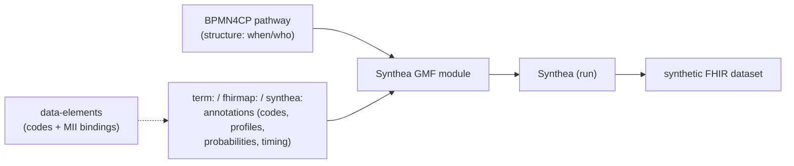

# Synthea & the BPMN Lung-Cancer Pathway — A Primer

> **For newcomers.** This document explains, from the ground up, **(1) what Synthea is and how it works**, **(2) why we consider the BPMN lung-cancer pathway and Synthea *together***, and **(3) how the two models map onto each other** — so that anyone joining the work understands why both belong in one workflow.
>
> **Status:** Draft v0.1 (working document on branch `research/synthea-dataset-generation`). Companion to [`synthea-dataset-generation-plan.md`](./synthea-dataset-generation-plan.md), which gives the concrete execution plan.

---

## 1. What is Synthea?

**Synthea** is an open-source **synthetic patient generator** developed at MITRE. It simulates the *whole life* of a fictional patient — birth, ageing, diseases, treatments, and death — and writes the result out as realistic-but-completely-fake electronic health records (FHIR, CSV, C-CDA, …). Because no real person is involved, the data carries no privacy risk and can be shared, published, and used to develop and test software freely (Walonoski et al., 2018 [^walonoski2018]).

The mental model has four parts:

1. **Agent-based, time-stepped simulation.** Each synthetic person is advanced through time in fixed steps (default 7 days). At every step, every active *module* runs.
2. **Modules are state machines.** Synthea's **Generic Module Framework (GMF)** describes a disease or care process as a JSON graph of **states** (e.g. *start an encounter*, *onset a condition*, *order a medication*) connected by **transitions**. The synthetic person "walks" this graph over simulated time (Synthea GMF wiki [^gmf]).
3. **Person attributes are the shared memory.** Modules don't talk to each other directly; they read and write named values on the person (e.g. `smoker`, `lung_cancer_stage`). Attributes are the "wiring" that lets one module react to another.
4. **Exporters** turn the accumulated record into output formats — by default **FHIR R4** (with US Core profiles).

Modules are authored visually in the **Synthea Module Builder** [^builder] (no hand-editing of JSON needed), and increasingly **from real-world data** — e.g. deriving module rules from population/registry statistics (Appenzeller et al., 2025 [^appenzeller2025]) or with **LLM assistance** (Kramer et al., 2025 [^kramer2025]).

> **Be honest about the limits.** An independent validation found that Synthea reproduces **demographics and the probability of receiving services reliably**, but does **not** realistically model **post-diagnosis outcomes or deviations from guideline-concordant care** (Chen et al., 2019 [^chen2019]). This matters for us: a lung-cancer cohort will look plausible at the population level, but realism of disease *trajectories* must be engineered deliberately — which is exactly where the BPMN pathway helps.

---

## 2. Why consider the BPMN pathway and Synthea *together*?

The two artifacts describe the **same lung-cancer journey from two complementary angles**:

| | Our BPMN4CP pathway | A Synthea GMF module |
|---|---|---|
| Question it answers | *When* does what happen, by *whom*? (the guideline process) | *What data* does a patient accumulate over time? |
| Nature | A clinically reviewed process model | An executable population simulator |
| Form | A directed graph of events/tasks/gateways | A directed graph of states/transitions |

Crucially, **both are directed graphs with branching logic**, and process graphs of this kind map cleanly onto formal state/transition execution models — this is a well-established result: BPMN has formal execution semantics and can be mapped to executable models such as Petri nets (Dijkman, Dumas & Ouyang, 2008 [^dijkman2008]). So translating a BPMN pathway into a Synthea state machine is a *structural* transformation, not a leap.

Four concrete reasons to pair them:

1. **One clinically validated source of truth.** The BPMN pathway is built on clinical guidelines, the CraNE EU standard, and empirically grounded modelling guidelines (7PMG; Mendling, Reijers & van der Aalst, 2010 [^mendling2010]). Using it as the *skeleton* of the Synthea module means the synthetic data follows the **same reviewed pathway** — giving provenance and avoiding a second, divergent description of the journey.
2. **Annotations close the gap — three small BPMN extensions.** The tooling that adds machine-readable clinical meaning to the BPMN is split into three focused [bpmn.io](https://bpmn.io) extensions (one per concern), and the [`…-data-elements`](https://github.com/forschungsgruppe-digital-health/mihub-lung-cancer-pathway-data-elements) repo carries the codes + MII bindings per pathway step. So **annotated BPMN supplies most of what a GMF clinical state needs** — the resource type, the code, and the simulation parameters. See *The three BPMN extensions* below.
3. **Clinical pathways are routinely modelled in BPMN — and are meant to be made computable.** BPMN is an established notation for clinical pathways (Scheuerlein et al., 2012 [^scheuerlein2012]; BPM+ Health, 2020 [^bpmplus]; BPMN4CP — Braun et al., 2014 [^braun2014], 2016 [^braun2016]), and transforming such pathways into executable artefacts is an active, demonstrated practice (e.g. FHIR2BPMN — Helm et al., 2022 [^helm2022]; comparative analysis of BPMN vs. openEHR Task Planning — Iglesias, Juárez & Campos, 2022 [^iglesias2022]).
4. **Single source → multiple artefacts.** The same annotated BPMN can feed *both* the Synthea generation module *and* the planned FHIR `PlanDefinition`/Implementation Guide (deliverable D3.2). One model, several computable outputs.

**In one sentence:** the BPMN pathway gives us the *clinically correct skeleton*; Synthea turns it into a *running data generator*; the annotations and data-element codes are the connective tissue.

### The three BPMN extensions (the annotation layers)

Clinical meaning is added to the BPMN with three small, independent [bpmn.io / bpmn-js](https://bpmn.io) extensions — each stores its data as standard BPMN `<extensionElements>` under its own namespace, so ordinary BPMN tools ignore it and the models stay portable:

| Extension repo | What it annotates on a BPMN element | Namespace |
|---|---|---|
| [`bpmn-extension-medical-terminology`](https://github.com/forschungsgruppe-digital-health/bpmn-extension-medical-terminology) | medical **codes** — SNOMED CT, LOINC, ICD-10-GM, OPS, ATC, ICD-O-3 | `term:` |
| [`bpmn-extension-fhir-mapping`](https://github.com/forschungsgruppe-digital-health/bpmn-extension-fhir-mapping) | the **FHIR resource** a step produces — `resourceType`, profile, key elements | `fhirmap:` |
| [`bpmn-extension-synthea-module`](https://github.com/forschungsgruppe-digital-health/bpmn-extension-synthea-module) | **simulation** parameters for Synthea — branch probability, timing/`Delay`, incidence, GMF state hints | `synthea:` |

Each extension is a **moddle descriptor** (defines the typed data + namespace it stores in the BPMN XML) plus a **properties panel** (so a modeller edits it visually in the bpmn-js editor), all built from the shared [`bpmn-extension-template`](https://github.com/forschungsgruppe-digital-health/bpmn-extension-template). Together they turn a plain BPMN diagram into a machine-readable one: the terminology + FHIR-mapping layers supply the **codes and resource types**, the Synthea layer supplies the **probabilities and timing** — exactly the inputs a GMF module needs (§4).

> **Status (July 2026):** these three repos **replace** the earlier single repo `bpmn-js-clinical-semantics`; the split is **in progress** (repos scaffolded from the template, the real `term:`/`fhirmap:` code being ported over), and the old monorepo will be **removed once porting completes**. The three repos are **private during porting** (so their links resolve only for org members for now).

---

## 3. How the models map: BPMN → Synthea GMF

The table below maps each BPMN concept to its Synthea GMF counterpart. **Fit** indicates how cleanly they correspond: ✅ direct, ⚠️ works with a caveat, ❌ no native equivalent (must be worked around). Mapping verified against the Synthea GMF documentation [^gmf][^gmf_states][^gmf_transitions][^gmf_submodules].

| BPMN concept | Synthea GMF construct | Fit | What a modeller must know |
|---|---|---|---|
| **Start event** | `Initial` (+ a `Guard`/`Delay` for the entry condition) | ⚠️ | A GMF module has **exactly one** `Initial` state and it performs no logic. Multiple BPMN starts must merge into one `Initial` + a conditional fan-out; entry criteria (age, risk) go in a following `Guard`/`Delay`. |
| **End event** | `Terminal` (or `Death` if clinically terminal) | ⚠️ | `Terminal` ends only **this module**, not the patient's life or other modules. Use `Death` only for genuinely lethal endings (it has population-wide effect). |
| **Task** (clinical) | Typed state: `Encounter`, `ConditionOnset`, `Procedure`, `MedicationOrder`, `Observation`/`MultiObservation`, `DiagnosticReport`, `CarePlanStart` | ⚠️ | Most clinical states must sit **inside an `Encounter`…`EncounterEnd` bracket**, often need a paired end state (`ConditionEnd`, `MedicationEnd`), and **require a terminology code**. One BPMN task may become several GMF states. |
| **Exclusive gateway (XOR)** | `conditional_transition` (rule-based) or `distributed_transition` (probabilistic) | ⚠️ | These have **different meanings** — see §4(a). A deterministic decision about one patient → `conditional_transition` (first true branch wins); a population split → `distributed_transition` (weights sum to 1.0). |
| **Parallel gateway (AND)** | *(none)* — linearise the branches or factor them into sequential `CallSubmodule`s | ❌ | GMF is **single-token / sequential**; there is no fork/join. Outcomes can be preserved (all branches run), but true concurrency and join-synchronisation cannot. |
| **Inclusive gateway (OR)** | *(none)* — emulate with a chain of independently guarded paths | ❌ | No OR-split that activates several branches at once. *(The GMF `Or` **logic condition** is a boolean test, not an OR-split — don't confuse them.)* Your [`CONVENTIONS.md`](../CONVENTIONS.md) rule **R5 (no OR-gateways)** — tool-enforced as SYN-5 — already avoids this. |
| **Intermediate / timer event** | `Delay` | ⚠️ | Maps well to a *timer* event (advances natural-history time, fixed or sampled range). A *message/signal* catch has no `Delay` equivalent — use a `Guard` on an attribute. Boundary timers have no analogue. |
| **Sequence flow** | transition (`direct_transition`, or conditional/distributed/complex) | ✅ | In GMF the transition is a **property of the source state**, not a standalone edge. A condition on a BPMN flow moves into the source state's `conditional_transition`. |
| **Sub-process / call activity** | `CallSubmodule` | ⚠️ | Strong match for a *reusable* sub-pathway (a separate submodule file with its own `Initial`/`Terminal`). Runs synchronously **in the same time step** and returns. Inline sub-processes must be extracted into their own submodule. |
| **Data object** | Person **attribute** via `SetAttribute` (write) / `Attribute` logic (read); `Counter` for numbers | ⚠️ | Attributes are a **flat, person-wide** key/value store (no token-local scope, no typed lifecycle). A data object's states (e.g. `[draft]`/`[final]`) must be encoded as attribute values you set explicitly. |
| **Lane / Pool** | *(none)* — approximate via `Encounter` class/provider metadata or a role attribute | ❌ | GMF models a **single patient's** record; it has no swimlanes, participants, or cross-pool message flow. Organisational responsibility and inter-organisation messaging are out of scope for a module. |

---

## 4. What BPMN does *not* give you (and Synthea needs)

The mapping above is the easy part. A clinical pathway BPMN describes the **ideal process**; a Synthea module simulates a **population over time**. Five things must be *added* on top of the BPMN — this is the heart of the work:

- **(a) Probabilities, not just logic.** A `distributed_transition` is a population sampler whose weights should **sum to 1.0** (if they sum to less, the remainder goes to the last branch; if more, surplus branches are ignored [^gmf_transitions]). BPMN gateways carry a *decision rule* for one patient, not a *prevalence* across many. For each branch decide: deterministic rule (`conditional_transition`) or population split (`distributed_transition`)? Getting this wrong silently changes the model's meaning.
- **(b) Terminology codes are mandatory.** Every clinical GMF state needs a code — **SNOMED CT** (conditions/procedures), **LOINC** (observations), **RxNorm** (medications), plus UCUM units. A BPMN task is just a labelled box. *(This is what the `term:` annotation layer and the data-elements catalog provide.)*
- **(c) Explicit timing / natural history.** Simulation time advances only at `Delay` states (and waiting `Guard`s/`Encounter`s). BPMN captures *order*, rarely the *elapsed time* between events. Disease progression, follow-up intervals, and survival must be injected as `Delay` distributions from clinical knowledge.
- **(d) Sequential execution vs. concurrency.** GMF runs one state at a time; BPMN AND/OR gateways assume concurrent tokens and synchronising joins. Concurrency must be **linearised** or split into sequentially-called submodules — outcomes preserved, true parallelism not.
- **(e) Population heterogeneity vs. the guideline ideal.** A BPMN pathway shows what *should* happen for one correctly-managed patient. A realistic synthetic cohort needs variation, non-adherence, comorbidity, recurrence, loss to follow-up, and mortality — calibrated to real incidence/prevalence. Translating the guideline 1:1 yields an unrealistically uniform "everyone follows the guideline perfectly" population (cf. the realism caveat in Chen et al., 2019 [^chen2019]).

**Takeaway:** BPMN gives the *structure*; the codes come from the annotations/data-elements; the **probabilities, timing, and population variation are net-new clinical/epidemiological input** that a modeller must supply.

---

## 5. The combined picture

The BPMN pathway is the clinically reviewed backbone; annotations + data-element codes supply terminology and FHIR mappings; a small `synthea:` layer adds probabilities and timing; Synthea executes the resulting state machine and emits the dataset. For the concrete steps, see [`synthea-dataset-generation-plan.md`](./synthea-dataset-generation-plan.md).

---

## References

### Synthea
[^walonoski2018]: Walonoski J, Kramer M, Nichols J, Quina A, Moesel C, Hall D, Duffett C, Dube K, Gallagher T, McLachlan S. **Synthea: An approach, method, and software mechanism for generating synthetic patients and the synthetic electronic health care record.** *Journal of the American Medical Informatics Association* 2018;25(3):230–238. doi:[10.1093/jamia/ocx079](https://doi.org/10.1093/jamia/ocx079). *(Erratum: JAMIA 2018;25(7):921, doi:[10.1093/jamia/ocx147](https://doi.org/10.1093/jamia/ocx147).)*
[^gmf]: Synthea project. **Generic Module Framework.** synthetichealth/synthea GitHub wiki. <https://github.com/synthetichealth/synthea/wiki/Generic-Module-Framework> (accessed 2026-06-16).
[^gmf_states]: Synthea project. **Generic Module Framework: States.** <https://github.com/synthetichealth/synthea/wiki/Generic-Module-Framework:-States> (accessed 2026-06-16).
[^gmf_transitions]: Synthea project. **Generic Module Framework: Transitions.** <https://github.com/synthetichealth/synthea/wiki/Generic-Module-Framework:-Transitions> (accessed 2026-06-16).
[^gmf_submodules]: Synthea project. **Generic Module Framework: Submodules.** <https://github.com/synthetichealth/synthea/wiki/Generic-Module-Framework:-Submodules> (accessed 2026-06-16).
[^builder]: Synthea project. **Generic Module Builder** (visual editor). <https://synthetichealth.github.io/module-builder/> · source: <https://github.com/synthetichealth/module-builder> (accessed 2026-06-16).
[^chen2019]: Chen J, Chun D, Patel M, Chiang E, James J. **The validity of synthetic clinical data: a validation study of a leading synthetic data generator (Synthea) using clinical quality measures.** *BMC Medical Informatics and Decision Making* 2019;19(1):44. doi:[10.1186/s12911-019-0793-0](https://doi.org/10.1186/s12911-019-0793-0).
[^kramer2025]: Kramer MA, Mathur A, Adams CE, Walonoski JA. **Leveraging Generative AI to Enhance Synthea Module Development.** arXiv preprint, 2025. arXiv:[2507.21123](https://arxiv.org/abs/2507.21123).
[^appenzeller2025]: Appenzeller A, Terzer N, Homeyer A, et al. **Automatic Extraction of Rules for Generating Synthetic Patient Data From Real-World Population Data Using Glioblastoma as an Example.** arXiv preprint, 2025. arXiv:[2512.14721](https://arxiv.org/abs/2512.14721).

### BPMN, clinical pathways & model transformation
[^dijkman2008]: Dijkman RM, Dumas M, Ouyang C. **Semantics and analysis of business process models in BPMN.** *Information and Software Technology* 2008;50(12):1281–1294. doi:[10.1016/j.infsof.2008.02.006](https://doi.org/10.1016/j.infsof.2008.02.006).
[^mendling2010]: Mendling J, Reijers HA, van der Aalst WMP. **Seven process modeling guidelines (7PMG).** *Information and Software Technology* 2010;52(2):127–136. doi:[10.1016/j.infsof.2009.08.004](https://doi.org/10.1016/j.infsof.2009.08.004).
[^scheuerlein2012]: Scheuerlein H, Rauchfuss F, Dittmar Y, Molle R, Lehmann T, Pienkos N, Settmacher U. **New methods for clinical pathways—Business Process Modeling Notation (BPMN) and Tangible Business Process Modeling (t.BPM).** *Langenbeck's Archives of Surgery* 2012;397(5):755–761. doi:[10.1007/s00423-012-0914-z](https://doi.org/10.1007/s00423-012-0914-z).
[^braun2014]: Braun R, Schlieter H, Burwitz M, Esswein W. **BPMN4CP: Design and implementation of a BPMN extension for clinical pathways.** *2014 IEEE International Conference on Bioinformatics and Biomedicine (BIBM)* 2014:9–16. doi:[10.1109/BIBM.2014.6999261](https://doi.org/10.1109/BIBM.2014.6999261).
[^braun2016]: Braun R, Schlieter H, Burwitz M, Esswein W. **BPMN4CP Revised — Extending BPMN for Multi-perspective Modeling of Clinical Pathways.** *49th Hawaii International Conference on System Sciences (HICSS)* 2016:3249–3258. doi:[10.1109/HICSS.2016.407](https://doi.org/10.1109/HICSS.2016.407).
[^helm2022]: Helm E, Pointner A, Krauss O, Schuler A, Traxler B, Arthofer K, Halmerbauer G. **FHIR2BPMN: Delivering Actionable Knowledge by Transforming Between Clinical Pathways and Executable Models.** *Studies in Health Technology and Informatics* 2022;292:9–14. doi:[10.3233/SHTI220311](https://doi.org/10.3233/SHTI220311).
[^iglesias2022]: Iglesias N, Juárez JM, Campos M. **Business Process Model and Notation and openEHR Task Planning for Clinical Pathway Standards in Infections: Critical Analysis.** *Journal of Medical Internet Research* 2022;24(9):e29927. doi:[10.2196/29927](https://doi.org/10.2196/29927).
[^bpmplus]: Object Management Group, BPM+ Health Community. **Field Guide to Shareable Clinical Pathways**, Version 2.0. 2020. <https://www.bpm-plus.org/healthcare-and-bpmn.htm>.

> **Standards.** BPMN 2.0 is published by the OMG (BPMN 2.0.2, formal/13-12-09, 2014, <https://www.omg.org/spec/BPMN/2.0.2/>) and by ISO as ISO/IEC 19510:2013 (which corresponds to BPMN 2.0.1).
>
> **Note for maintainers:** while verifying these references, two entries in [`../CONVENTIONS.md`](../CONVENTIONS.md) were found to need correction — ref [10] should be **Iglesias, Juárez & Campos** (JMIR), not "Martínez-Salvador"; and the BPMN 2.0.2-vs-ISO 19510:2013 conflation (ISO edition ≈ 2.0.1) could be clarified. Not changed here.
