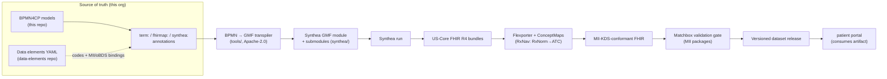
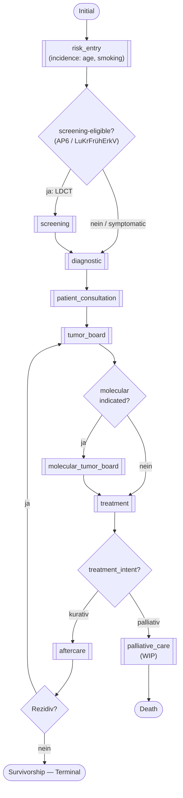

# Synthea Dataset Generation from the BPMN Lung-Cancer Pathway — Execution Plan

> **Status:** Draft v0.1 (working document, engineering plan — not a clinical artifact). Originated on branch `research/synthea-dataset-generation`; maintained on `dev` since 2026-06-16; export-ignored from the release archive per [ADR-0002](decisions/0002-versioning-and-release.md) Decision 4.
> **Companion notes:** [`synthea-and-bpmn-primer.md`](./synthea-and-bpmn-primer.md) (concepts: what Synthea is, how BPMN maps onto GMF) · [`data-sources-for-probabilities-and-timing.md`](./data-sources-for-probabilities-and-timing.md) (where the numbers for Phase 5 come from).
> **Scope:** How to generate a synthetic lung-cancer FHIR dataset *from* the BPMN4CP pathway models in this repo, conformant to the MII Kerndatensatz (incl. Erweiterungsmodul Onkologie), for consumption by the MiHUB patient portal and other downstream tools.
> **Audience:** AP3 modellers + medical-informatics engineers.
> **Why here:** The portal only needs the *resulting dataset*, not the generation tooling. The BPMN pathway is the spec for the Synthea model, so model + generator + dataset belong together (see §2).

---

## 1. Goal & non-goals

**Goal.** Turn the lung-cancer Patient Journey (BPMN4CP) into a reproducible pipeline that emits a **versioned, MII-KDS-conformant synthetic FHIR R4 dataset** covering the full pathway — screening, diagnosis, tumor board, (molecular) staging, curative *and* palliative treatment, aftercare, and death — not only the palliative/terminal slice that Synthea's stock `lung_cancer` module models.

**Non-goals (for now).**
- No real or realistic patient data — synthetic only, obviously-artificial names.
- The portal repo does **not** host Synthea, Flexporter, or the transpiler — it consumes a published dataset artifact + validates on ingest (§2, §9).
- Not a runtime clinical decision system; the BPMN→FHIR `PlanDefinition` track (D3.2, M16) is related but separate (noted in §10).

---

## 2. Decision: repo placement & licensing

| Concern | Decision |
|---|---|
| Where does the Synthea module + generation pipeline live? | **This repo** (`mihub-lung-cancer-pathway`) — co-located with the BPMN source of truth it is generated from. |
| Where does the portal get data? | The portal consumes a **versioned dataset release** (NDJSON/FHIR bundles as GitHub release assets) + runs its own validation gate. No Synthea in the portal. |
| Content vs code licensing | This repo is **CC-BY-4.0** (content: `.bpmn`/`.svg`/docs). The **transpiler and scripts are code → Apache-2.0.** Mirror the dual-license pattern of `mihub-lung-cancer-pathway-data-elements` (CC-BY content + Apache scripts). Put the transpiler under [`tools/`](../tools/) — which already hosts the conformance tooling ([AGENTS.md](../AGENTS.md) "Artifacts vs. tooling") — and clarify code-vs-content licensing. |
| Generated GMF module + Flexporter mapping | Treat the GMF JSON + mapping as build artifacts living under `synthea/` (regenerable from BPMN). |

---

## 3. Source artifacts & reusable assets

**Inputs (this org, already cloned locally):**

| Asset | Role in the pipeline |
|---|---|
| `mihub-lung-cancer-pathway` (this repo) | BPMN4CP models under [`models/`](../models/) → Synthea state-machine **topology** (when/who, branches, loops). Consumed **read-only** — agents may not edit `.bpmn` ([AGENTS.md](../AGENTS.md)). |
| `mihub-lung-cancer-pathway-data-elements` | YAML data elements → **codes + MII-KDS/oBDS bindings** per pathway step (`care_process.trigger` links elements to steps; `build-fhir-logical-models.py` already emits FSH) |
| [`bpmn-extension-medical-terminology`](https://github.com/forschungsgruppe-digital-health/bpmn-extension-medical-terminology) | `term:` codes on BPMN elements — SNOMED/LOINC/ICD-10-GM/OPS/ATC/ICD-O-3 (stored as BPMN `extensionElements`) |
| [`bpmn-extension-fhir-mapping`](https://github.com/forschungsgruppe-digital-health/bpmn-extension-fhir-mapping) | `fhirmap:` — the FHIR `resourceType`/profile/key-element a step produces |
| [`bpmn-extension-synthea-module`](https://github.com/forschungsgruppe-digital-health/bpmn-extension-synthea-module) | `synthea:` — simulation parameters (branch probability, timing/`Delay`, incidence, GMF state hints) |
| `kerndatensatzmodul-onkologie` (+ base modules) | MII profile packages = the conformance target + validation packages |

**Tooling:** Synthea (Apache-2.0, GMF + Flexporter), Module Builder, Matchbox (validation).

---

## 4. Target pipeline architecture

**Principle (carry through every phase):** model *clinical reality* at generation time (GMF, Synthea-native SNOMED/LOINC/RxNorm); handle *MII profile + German terminology conformance* at export time (Flexporter + ConceptMaps). Never hard-code MII/German codes into the GMF states.

---

## 5. Execution plan (phased TODO)

> 🔒 **Ways of working.** The `.bpmn` models are edited **only by human modellers** and re-validated (Abnahmetest SEM-6); agents/tools are **read-only** on `**/*.bpmn` ([AGENTS.md](../AGENTS.md) hard rules, `guard-model-files` hook). This includes adding `term:`/`fhirmap:`/`synthea:` annotations (done in the bpmn-js editor with the three extensions — [terminology](https://github.com/forschungsgruppe-digital-health/bpmn-extension-medical-terminology) / [fhir-mapping](https://github.com/forschungsgruppe-digital-health/bpmn-extension-fhir-mapping) / [synthea-module](https://github.com/forschungsgruppe-digital-health/bpmn-extension-synthea-module)) and any remodelling — report findings via [`docs/model-issues/`](model-issues/), don't self-edit. The Synthea/transpiler side (this plan's tooling, under `tools/`/`synthea/`) consumes the models read-only.

### Phase 0 — Setup & decisions
- [ ] Confirm repo placement + dual-license (§2); add Apache `LICENSE` for `tools/`.
- [ ] Pin a Synthea version (record commit/tag) for reproducibility.
- [ ] Create `synthea/` (artifacts) and `tools/bpmn2gmf/` (transpiler) skeletons.
- [ ] Decide dataset cohort target (e.g. N patients; stage/histology/biomarker mix; curative vs palliative ratio).

### Phase 1 — **Step (b): target Synthea module topology** → see §7
- [ ] Define main module `lung_cancer_mihub` + one submodule per BPMN sub-pathway under [`models/`](../models/) (nine: initial-entry, screening, diagnostic, patient-consultation, tumor-board, molecular-tumor-board, treatment, palliative-care [WIP], aftercare).
- [ ] Define the shared Person-attribute contract (stage, histology, biomarkers, treatment_intent…).
- [ ] Review the topology diagram with clinical/AP3 before any JSON.

### Phase 2 — **Step (a): annotation conventions** → see §6
- [ ] Adopt `term:` for codes and `fhirmap:` for FHIR resource type/profile (the `bpmn-extension-medical-terminology` + `bpmn-extension-fhir-mapping` extensions).
- [ ] Specify a minimal **new `synthea:` annotation layer** for simulation-only properties (branch probability, delay/timing, entry/incidence, state-type override, attribute name).
- [ ] Use the `synthea:` layer from its own repo, [`bpmn-extension-synthea-module`](https://github.com/forschungsgruppe-digital-health/bpmn-extension-synthea-module) (scaffolded from `bpmn-extension-template`; porting in progress).
- [ ] Align BPMN element/annotation IDs with data-element IDs (`care_process.trigger`) so codes/MII bindings can be pulled from the data-elements catalog.

### Phase 3 — GMF-compatibility modelling pass (human modellers) → see §8
- [ ] Reconcile the **known baseline findings** first ([`docs/model-issues/2026-06-25-baseline.md`](model-issues/2026-06-25-baseline.md)): the **13 OR-gateways** — treatment 2, aftercare 4, palliative-care 7 (SYN-5 / R5; see the 2026-09-04 addendum in the baseline and [`model-issues/2026-06-29-palliative-care.md`](model-issues/2026-06-29-palliative-care.md)), the structural + dead-activity defects, the molecular-tumor-board soundness deadlock (STR-1), and decomposing the overarching pathway (5 start events, 140 elements > 50 — SYN-4).
- [ ] Apply the §8 preconditions to the overarching pathway + its 9 sub-pathways (single entry/exit, typed tasks, named end-states, attribute data objects). Several are already tool-enforced by the conformance gate (`npm run check:conformance`): no-OR (SYN-5), single start/end (SYN-2), labels (SYN-3), size (SYN-4).
- [ ] Add the **curative-intent branch** + surveillance/recurrence loop to the [treatment](../models/lung-cancer-treatment-pathway.bpmn) / [aftercare](../models/lung-cancer-aftercare-pathway.bpmn) models (the main clinical extension).
- [ ] Add entry/risk criteria (age, smoking) via the [screening](../models/lung-cancer-screening-pathway.bpmn) / overarching start for the incidence gate.

### Phase 4 — Transpiler (BPMN4CP → GMF)
- [ ] **Manual first:** hand-build the GMF in the Module Builder using the §7 topology (reading [`models/`](../models/) read-only), to validate the mapping and discover annotation gaps.
- [ ] **Then automate:** `tools/bpmn2gmf` parses BPMN 2.0 XML (e.g. `bpmn-moddle`/Camunda model API/`bpmn-python`), emits GMF JSON; reads `fhirmap:resourceType`→state type, `term:coding`→codes, `synthea:*`→probabilities/timing; unannotated elements become explicit `TODO` placeholders.
- [ ] Round-trip: regenerate on BPMN change; validate output in the Module Builder.

### Phase 5 — Clinical enrichment (the inputs Synthea needs that BPMN lacks)
- [ ] Populate **branch probabilities** (sum to 1.0 per gateway) — ground in epidemiology / S3-LL / registry; cite in `remarks`. Source catalogue: [`data-sources-for-probabilities-and-timing.md`](./data-sources-for-probabilities-and-timing.md).
- [ ] Populate **timing/Delay distributions** (time-to-diagnosis, cycle intervals, surveillance cadence, survival by stage).
- [ ] Populate **codes** for every clinical task (from data-elements catalog where available).
- [ ] Add structured oncology data the stock module lacks: ICD-O-3 histology, TNM components, grading, ECOG, molecular variants, response/Verlauf (model at generation time in SNOMED/LOINC; remap later).

### Phase 6 — Generate (Synthea → US-Core FHIR)
- [ ] Run: `java -jar synthea-with-dependencies.jar -d ./synthea/modules -m "lung_cancer_mihub*" -p <N> -a 45-85 -s <seed>`.
- [ ] Inspect `output/fhir/`; iterate Phase 4–5 until the cohort distribution matches intent.

### Phase 7 — MII conformance (export-time mapping)
- [ ] Author a **Flexporter** mapping: `apply_profiles` (MII profile URLs from `fhirmap:`/data-elements) + code remap.
- [ ] Wire ConceptMaps: RxNorm→ATC (RxNav), curated SNOMED→ICD-10-GM (C34.\*) + SNOMED→OPS lookups for the codes this module emits.
- [ ] Author the oncology core that Synthea can't generate cleanly (TNM Observations, ICD-O-3, grading, ECOG, genetic variants) — prefer `excel2fhir`/FSH for a few guideline-perfect anchor cases.

### Phase 8 — Validation gate
- [ ] Stand up Matchbox (or HAPI + remote terminology) loaded with `de.medizininformatikinitiative.kerndatensatz.*` packages.
- [ ] Validate every generated bundle against MII profiles **with a German-edition terminology server attached** (else SNOMED/intensional ValueSets pass vacuously).
- [ ] Treat the gate as the conformance definition; fail CI on non-conformance.

### Phase 9 — Publish & consume
- [ ] Publish a **versioned dataset release** (NDJSON transaction bundles + provenance: BPMN version, module version, seed, MII package versions).
- [ ] Define the portal **consumption contract** (format, profile versions, load/seed mechanism); portal re-validates on ingest.
- [ ] Sanitize names to obviously-artificial (e.g. `Max Mustermann-Testpatient`) before release.

---

## 6. Step (a) — Annotation conventions (detail)

**Reuse, don't reinvent.** The `bpmn-extension-medical-terminology` and `bpmn-extension-fhir-mapping` extensions cover the two hard layers:

| Need | Layer | Example (BPMN `extensionElements`) |
|---|---|---|
| Terminology code on a task | `term:` | `<term:coding system="http://snomed.info/sct" code="173171007" display="Lobectomy of lung"/>` |
| FHIR resource the task produces | `fhirmap:` | `<fhirmap:resourceMapping resourceType="Procedure" interaction="create" direction="output"/>` |
| MII profile for the export step | `fhirmap:` | `profile="https://www.medizininformatik-initiative.de/fhir/.../Procedure"` |

**Add a minimal new `synthea:` layer** only for simulation-only properties that `term:`/`fhirmap:` do not express:

| Annotated element | `synthea:` property | Maps to GMF |
|---|---|---|
| Outgoing flow of an XOR gateway | `probability` (0–1, sum to 1.0 per gateway) and/or `condition` (attribute expr) | `distributed_transition` / `conditional_transition` |
| Timer event / task | `delay` (`exact`/`range`/`exponential` + unit) | `Delay` |
| Start event | `incidence` / entry guard (age, smoking) | `Initial` + `Guard` + risk submodule |
| Task (override) | `stateType` when `fhirmap:resourceType` is insufficient (`SetAttribute`, `Symptom`, `CarePlanStart`) | GMF state type |
| Data object | `attribute` (Person attribute name) | `SetAttribute` / `Attribute` logic |

**Home:** the `synthea:` layer lives in its own repo, [`bpmn-extension-synthea-module`](https://github.com/forschungsgruppe-digital-health/bpmn-extension-synthea-module) — a bpmn.io moddle-extension + properties-panel from the shared [`bpmn-extension-template`](https://github.com/forschungsgruppe-digital-health/bpmn-extension-template) — so modellers set probabilities/timing in the same editor. The transpiler then reads all three namespaces (`term:`/`fhirmap:`/`synthea:`).

---

## 7. Step (b) — Target Synthea module topology (detail)

One main module + one submodule per BPMN sub-pathway (1:1 with [`models/lung-cancer-<phase>-pathway.bpmn`](../models/), naming per [ADR-0004](decisions/0004-repo-structure-and-model-naming.md)), plus a risk/entry submodule (cf. stock `lung_cancer/lung_cancer_probabilities`). Screening and palliative-care (WIP) have their own models, and since 2026-09-04 so does initial-entry (#77: entry via symptomatic presentation / incidental nodule finding — the BPMN counterpart of the `ENTRY` "symptomatic" branch below; the diagram itself predates it and is not yet updated).

**Files (under `synthea/modules/`):** `lung_cancer_mihub.json` (main) + `lung_cancer_mihub/{risk_entry, screening, diagnostic, patient_consultation, tumor_board, molecular_tumor_board, treatment, palliative_care, aftercare}.json` — one submodule per source model in [`models/`](../models/) (plus `risk_entry`).

**Shared Person-attribute contract** (the cross-submodule wiring): `lc_histology` (NSCLC/SCLC), `lc_uicc_stage` (1–4), `lc_biomarker_egfr` / `_alk` / `_pdl1`, `lc_treatment_intent` (curative/palliative), `lc_resectable`, `lc_recurrence`, plus engine attributes (`smoker`, `quit smoking age`).

**Key extension vs stock module:** the stock module routes *every* diagnosed patient to palliative care + death. Here, `treatment` branches on `lc_treatment_intent`/`lc_uicc_stage` into a **curative path** (surgery → adjuvant therapy → `aftercare` with a surveillance/recurrence loop → Survivorship) *or* the palliative path.

---

## 8. Preconditions & GMF-compatibility modelling conventions

> Apply these **while modelling the BPMN**, so the pathway transpiles cleanly into Synthea GMF. They **extend** `CONVENTIONS.md`; the R-numbers below reference its 7PMG rules. ✅ = your conventions already enforce this.

**Structural**
- [ ] ✅ **No OR-gateways** (R5, tool-enforced as SYN-5 / bpmnlint `no-inclusive-gateway`). GMF has no inclusive-OR semantics — use **XOR** (→ conditional/distributed transition) and **AND** (→ parallel) only. *(13 OR-gateways still remain — treatment 2, aftercare 4, palliative-care 7 — [model-issues Issue 1](model-issues/2026-06-25-baseline.md) with its 2026-09-04 addendum, and [palliative-care Issue P1](model-issues/2026-06-29-palliative-care.md).)*
- [ ] ✅ **One start, explicitly named end-states** (R3). Each (sub)pathway = one Synthea (sub)module with a single `Initial` and named `Terminal`(s); map terminal clinical states to `Terminal` vs `Death`.
- [ ] ✅ **Structured split/join** (R4). Every split has a matching join; avoid crossing flows and unstructured cycles (except explicit, bounded loops, e.g. surveillance).
- [ ] ✅ **Decompose by phase into sub-pathways** (R7) → these become Synthea **submodules** (`CallSubmodule`). Keep each ≤ ~30–50 elements (R1).
- [ ] **Single entry / single exit per sub-pathway** — a submodule returns to its caller at its `Terminal`; avoid multiple uncontrolled exits.

**Decisions, parallelism, timing**
- [ ] **Every XOR outflow carries a machine-readable branch rule**: a `synthea:condition` (attribute expression) and/or a `synthea:probability`. Free-text `ja`/`nein` labels alone are not transpilable.
- [ ] **Branch probabilities per gateway sum to 1.0** and are grounded in epidemiology (cite source). Mark the BPMN `Default` flow.
- [ ] **AND-gateways (parallel)**: remember GMF modules are single-token/sequential — parallel branches are linearised (order-independent) or split into submodules. Don't model parallel branches with hidden ordering dependencies.
- [ ] **Time via Timer events** → `Delay`; annotate `synthea:delay` (exact/range/exponential + unit). Recurring timers (e.g. "alle 3 Monate") → bounded GMF Delay loops with an exit condition.

**Clinical content / data**
- [ ] **Type every clinical task** with `fhirmap:resourceType` → GMF state type (Procedure / MedicationRequest / Observation / Condition / DiagnosticReport / CarePlanStart). Administrative tasks with no clinical output → `synthea:stateType=Simple/Delay` or flag non-clinical.
- [ ] **Every clinical task has ≥1 `term:coding` in a Synthea-native system**: SNOMED (condition/procedure/encounter), LOINC (observation), RxNorm (medication). Put German codes (ICD-10-GM/OPS/ATC) in parallel `term:` codings — used at the MII **export** step, not in the GMF state.
- [ ] **Pull codes/bindings from the data-elements catalog** where a `care_process.trigger` links the element to the step (single source of truth; avoid divergent inline codes).
- [ ] **Data objects that gate decisions = Person attributes**: name them so the transpiler can derive an attribute (`synthea:attribute`, e.g. data object "UICC-Stadium" → `lc_uicc_stage`).
- [ ] **Model the entry/risk gate**: the overarching start ("V.a. Lungenkarzinom") needs generation-time entry criteria (age band, smoking) + a prevalence target, so Synthea knows *who* enters the pathway.
- [ ] **Keep guideline references** (`[LC SoS x.x.x]`, S3-LL/ESMO) on elements → transpiled into GMF `remarks` citations.

**Hygiene**
- [ ] ✅ Verb-object task labels; gateways as questions (R6) — improves auto-generated state names.
- [ ] Run the **conformance + soundness gate** before transpiling: `npm run check:conformance` (bpmnlint + metrics + XSD) and `npm run check:soundness` — the Abnahmetest gate ([`docs/governance/`](governance/)) enforces SYN-2 (single start/end), SYN-3 (labels), SYN-4 (size), SYN-5 (no-OR) and STR-1..4 (soundness). A model that passes it is largely GMF-ready.
- [ ] Reconcile the known baseline findings first ([`docs/model-issues/`](model-issues/)) — the 13 OR-gateways, dead activities, the molecular-tumor-board deadlock, and the overarching decomposition. Cleaning them benefits both the clinical model and the transpiler.

---

## 9. Portal consumption contract (to define in Phase 9)
- Output format: MII-KDS-conformant FHIR R4 transaction bundles (NDJSON), profile versions pinned.
- Delivery: GitHub release asset in this repo, semver-tagged, with provenance metadata.
- Portal side: load as seed/test fixtures + **re-validate on ingest** (Matchbox/MII packages); the portal stays free of Synthea/generation deps.

---

## 10. Open decisions
- [ ] Single source for codes: inline `term:`/`fhirmap:` in BPMN **vs** referenced from the data-elements catalog (recommended: catalog is source, annotations reference element IDs).
- [x] ~~Build the `synthea:` layer inside a monorepo vs standalone~~ — **decided:** it has its own repo, [`bpmn-extension-synthea-module`](https://github.com/forschungsgruppe-digital-health/bpmn-extension-synthea-module).
- [ ] Transpiler language/library (`bpmn-moddle` JS vs Camunda Java vs `bpmn-python`).
- [ ] How much oncology core to generate via the extended GMF module vs author via `excel2fhir`/FSH anchor cases.
- [ ] Relationship to D3.2 (FHIR `PlanDefinition`/IG, M16): can the same annotated BPMN feed both the Synthea module *and* the computable-pathway FHIR artifacts? (Strategic single-source upside.)

---

## 11. References

**This repo:** [`README.md`](../README.md) (project landing page) · [`CONTRIBUTING.md`](../CONTRIBUTING.md) (how to contribute, release-candidate procedure) · [`models/`](../models/) (BPMN sources + [`README`](../models/README.md)) · [`CONVENTIONS.md`](../CONVENTIONS.md) (7PMG modelling rules) · [`AGENTS.md`](../AGENTS.md) (ways of working, read-only models) · [`docs/governance/`](governance/) (Abnahmetest gate) · [`docs/model-issues/`](model-issues/) (known findings) · [`docs/decisions/`](decisions/) (ADRs) · conformance tooling under [`tools/`](../tools/) + [`skills/`](../skills/).

**Synthea & MII:**
- Synthea GMF: <https://github.com/synthetichealth/synthea/wiki/Generic-Module-Framework> · Flexporter: <https://github.com/synthetichealth/synthea/wiki/Flexporter> · Module Builder: <https://synthetichealth.github.io/module-builder/>
- BPMN annotation extensions (this org): [`bpmn-extension-medical-terminology`](https://github.com/forschungsgruppe-digital-health/bpmn-extension-medical-terminology) (`term:`), [`bpmn-extension-fhir-mapping`](https://github.com/forschungsgruppe-digital-health/bpmn-extension-fhir-mapping) (`fhirmap:`), [`bpmn-extension-synthea-module`](https://github.com/forschungsgruppe-digital-health/bpmn-extension-synthea-module) (`synthea:`) — from [`bpmn-extension-template`](https://github.com/forschungsgruppe-digital-health/bpmn-extension-template); they replace the retiring monorepo `bpmn-js-clinical-semantics`.
- `mihub-lung-cancer-pathway-data-elements` (this org) — data elements + codings + MII/oBDS mappings.
- MII Onkologie IG: <https://www.medizininformatik-initiative.de/Kerndatensatz/KDS_Onkologie_2026/MIIIGModulOnkologie.html>
